```mermaid
graph LR
    G(("🍆"))

    A(("🥒")) --> |Input| E((Make salad))
    B(("🍅")) --> |Input| E((Make salad))
    C(("🥬")) --> |Input| E((Make salad))
    D(("🧅")) --> |Input| E(("Make salad"))
    %% D(("🥑")) --> |Input| E(("Make salad"))
    E --> |Output| F(("🥗"))
    %% E --> |Output| F(("🥗 🍌"))
    %% E --> |Output| F(("🥗 🥕 🍆"))

    H(("🍌"))
```

# Functional Programming Fundamentals

What is functional programming?

> [Functional programing] is a programming paradigm where applications are composed using pure functions, avoiding shared mutable state and side-effects. Functional programming is usually more declarative than imperative, meaning that we express what to do rather than how to do it. - Eric Elliott, Composing Software

Functional programming focuses on simplicity, flexibility, and composition with functions.

> OO makes code understandable by encapsulating moving parts.  FP makes code understandable by minimizing moving parts. - [Michael Feathers](https://twitter.com/mfeathers/status/29581296216)
Why learn functional programming?

Software composition: breaking down and decompose problems into smaller parts and put those components together to solve the problem.

Function composition: "The process of combining two or more functions to produce a new function or perfrom some computation" - Eric Elliot, Composing Software

Compose functions by applying a function to the output of another function.

```typescript
const plusOne = n => n + 1;
const timesTwo = n => n * 2;

const addAndMultiply = n => {
  const afterPlusOne = plusOne(x);
  const afterTimeTwo = timeTwo(afterPlusOne);
  return afterTimesTwo;
};
 
addAndMultiply(20); // 42
```

## Functional JavaScript

### Variables
- `var`: can redeclar, can reassign, useful for flexibility in experimental environments
- `let`: can't redeclare, can reassign, useful for imperative iteration e.g. for and while loops
- `const`: can't redeclare, can't be reassigned, but can mutate properties.

Best practice: default to the strictest: `const`.

#### Related concepts
- Function parameters
- Immutability

### Functions

- Procedure: a sequence of program instructions that performs a specific task and do not return a value. Procedures tell you how to do something, functions tell you what to do.
- Function: a mapping of inputs to an output. A process that takes one or more inputs and returns a single output. Functions should be simple, independent, and flexible.
- Method: a procedure associated with a message and an object that may or may not return a value.

#### Examples



```typescript
// Procedure
updateQuality(); // void

// Function
updateQuality(items); // []

// Method
gildedRose.updateQuality(); // void or []
```

### Mutable and immutable array methods

Immutability: "The state of being unchangeable in the memory after creation." - Wiktionary

- Mutable methods on the `Array.prototype` object are methods that iterate and change the array.
- Immutale methods on the `Array.prototype` object are methods that copy and iterate the array.

Best practice: Use immutabile data by library or convention.

#### Mutable
- pop
- push
- shfit
- unshift
- reverse
- sort
- splice

#### Immutable
- map
- filter
- reduce
- slice
- concat
- flat
- incldues

#### Examples
```typescript
map([🐮, 🥔, 🐔, 🌽], cook) // [🍔, 🍟, 🍗, 🍿]
filter([🍔, 🍟, 🍗, 🍿], hasMeat) // [🍔, 🍗]
reduce([🍔, 🍗], eat) // 💩
```

Source: https://twitter.com/steveluscher/status/741089564329054208

### Control flow

Control flow is the order in which statements are executed that decides when and how many something should happen.

#### Examples
- for
- while
- switch
- throw catch finally
- if else
- ternary operator

## Functional thinking

Functional thinking requires separating data, functions, and actions, isolating side effects, and using function composition to solve problems and build software.

### Data flow: Data Functions, and Actions

Functional software is organized into three distinct categories: data, functions, and actions. Distinguishing between these three concepts is essential in functional programming. Functional code tends toward simplicity by using data and functions where possible and actions only where necessary.

> Data > Functions > Actions

#### Composition and Contamination

When you compose an action with a data, a function, or another action, the result also becomes an action.

| Data                        | Functions                       | Actions                       |
|-----------------------------|---------------------------------|-------------------------------|
| data + data -> data         | function + data -> function     | action + data -> action ☢️     |
| data + function -> function | function + function -> function | action + function -> action ☢️ |
| data + action -> action ☢️    | function + action -> action ☢️  | action + action -> action ☢️   |

```typescript
function applyDiscount(item, discount) {
  // code to apply discount to item
  updateOrder(item); // ! Calls impure action updateOrder
}
function checkForDiscount(item, discountCodes) {
  // code to get discount for item
  applyDiscount(item, discount); // ! Calls impure applyDiscount
}
function addItems(items) {
  items.forEach(item => {
    checkForDiscount(item, discountCodes); // ! Calls impure checkForDiscount
  });
}
addItems(items, discountCodes); // ! Impure actions all the way down
```

#### Data: Facts about information

> A representation of facts or ideas in a formalized manner capable of being communicated or manipulated by some process. - Wiktionary

Practice identifying data, from functions, and actions by asking questions like:

- Is this a function or a side effect? Is this function doing anything else other than returning a value?
- Are there any external or implicit inputs to the function? 
- Am I mutating any variables? Do I really need to mutate this variable? How could I do this without mutation?
- Do I need to know anything about the world outside of this function to understand what it does? 

**Exercise: Identify data, functions, and actions in the Gilded Rose**
- `Item`
- `GildedRose.items`

#### Functions: A process that takes one or more inputs and returns a single output.

- `GildedRose.constructor`
- `GildedRose.updateQuality`

#### Actions: (functions with side effects): A procedure that produces an observable effect in the world that depends on time, when and how many times it happens.

Actions are called for side effects, not for return values.

  - Logging
  - Rendering

#### Side Effects: Changes to external state. Reading or writing to an external variable or reference.
  - Math.random
  - setTimeout
  - console.log
  - fetch
  - document.innerHTML

### Declarative and imperative code

- Imperative code uses explicit control flow and implicit data flow. It describes **how** to do something and how each step is the process is connected. Often uses statements.
- Declarative code uses explicit data flow and implicit control flow. It describes **what** to do using verbs. Uses expressions.

|             | Control flow | Data flow |
|-------------|--------------|-----------|
| Imperative  | Explicit     | Implicit  |
| Declarative | Implicit     | Explicit  |

### Statements and expressions

- Statement: code that performs an action e.g. `for`, `if`, `switch`, `throw`. Some statements can be identified by their use of curly brackets`{}` to declare blocks or a sequence of imperative steps. Another example is the `return` statement, which ends function execution and returns the value passed to it. Function declarations are statements.

- Expression: code that evaluates to a value e.g. function calls, values, operators.

Best practice: prefer function expression to function declarations because function expressions are simpler and more explicit because they are not hoisted and they evaluated in top to bottom in the order they are declared.

### References and values

- [Primitive](https://developer.mozilla.org/en-US/docs/Glossary/Primitive): "a primitive (primitive value, primitive data type) is data that is not an object and has no methods or properties." There are seven primitive data types: string, number, bigint, boolean, undefined, symbol, and null. Primitives are immutable.
- [Object](https://developer.mozilla.org/en-US/docs/Web/JavaScript/Reference/Global_Objects/Object): a collection of properties that may include primitives and other objects.
  In JavaScript we use and refer to objects in two ways:
  1. As Object-Oriented Programming (OOP) objects that inherits properties and methods from `Object.prototype`.
  2. As hash map data structures, implemented as either an associative array or a dictionary to map keys to values.

### Mutation and Immutability

```typescript
class ShoppingCart() {
  constructor(items = [], total = 0) {
    this.total = total;
    this.items = items;
  }
  addItem(item) {
    this.items.push(item);
    this.total += item.price;
  }
  removeItem(id) {
    // ..
  }
  checkout() {
    // ..
  }
}

const cart = new ShoppingCart();

cart.total; // 0
cart.items; // []

// Mutation
cart.addItem({ name: 'tropical fish', 🐠, price: 5.00 });

cart.items; // [{ name: 'tropical fish', 🐠, price: 5.00 }]
cart.total; // 5.00

// Mutation
cart.addItem({ name: 'mouse', 🐁, price: 20.00 });

cart.items; // [{ name: 'tropical fish', 🐠, price: 5.00 }, { name: 'mouse', 🐁, price: 20.00 }]

cart.total; // 25.00
```

#### Examples

- prompt(‘Confirm close?’); // function calls
- console.log(‘debug’, something); // method calls
- new Date() // constructors
- item // accessing a mutable variable
- item.price // property access
- items[0] // array access
- Math.random // indeterminate
- setTimeout // depends on time
- let isOpen = false; // assignment
- delete item.discountCode; // property deletion

#### Related concepts
- Immutability

## Exercises

Start from scratch or migrate current solution to this repository.

1. Read the chapters in Composing Software that look interesting to you.
  - The Dao of Immutability
  - What is Functional Programming?
  - A Functional Programmer's Introduction to JavaScript
1. Identify and note examples of data, functions, actions, and side effects.
1. Identify and note examples of imeprative code.
1. Decompose and separate data, functions, and actions.
1. Use function composition to refactor imperative control flow and statements to declarative data flow and expressions.

## References
- Composing Software - Eric Elliott
- Grokking Simplicity - Eric Normand
- [Gilded Rose Refactoring Kata](https://github.com/emilybache/GildedRose-Refactoring-Kata)